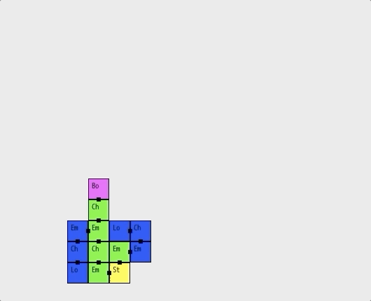

# LDungeon :
## A Ruby dungeon generator using L-Systems

### L-Systems :
L-systems iteratively apply a finit set of transformations to an initial string until the desired number of iterations is reached or the transformed string satisfies some condition, usually length, but the condition can be anything else, like having a certain number of a specific character, or a combination of characters, etc.\
The final string is then interpreted as a list of commands that can be anything, like drawing a branch in a tree, or in our ase placing a cell in a dungeon grid.

L-systems: https://en.wikipedia.org/wiki/L-system  
L-systems in Ruby: https://weblog.jamisbuck.org/2015/5/7/experimenting-with-l-systems.html  

### Dungeon generation basics :
In LDungeon, the dungeon generation is handled by the __Map__ class defined in the __LDungeon__ module. It is initialized with a initial string, a hash of iterations rules and a hash of layout rules:
* the initial string has to have a 'S' and an 'E' character. They are the start and exit cells for the dungeon. A valid initial string could be `'SeclE'` (where 'e', 'c' and 'l' will later be defined in the layout rules). 'S' and 'E' are reserved characters and can't be defined in the layout rules.
* the iteration rules define the transformations applied to the string. Let's consider the following hash:\
`{ 'S' => 'lcS',  
   'e' => 'cle' }`\
These rules mean: when you see a 'S', replace it with 'lcS', and when you see an 'e', replace it with 'lc'. So iterating on our initial string would look like this:
  1. first iteration:  `'SeclE'`
  1. second iteration: `'lcScleclE'`
  1. third iteration:  `'lclcSclcleclE'`\
  ...
* the layout rules hash is where you can map each character in the string to a layout rule. Again, let's consider an example:\
`{ 'e' => { type: :empty,
            mode: :replace },
   'c' => { type: :challenge,
            mode: :mix },
   'l' => { type: :loot,
            mode: :discard } }`
This hash tells the Map class to create and place a cell in the dungeon that will have the type `:empty` and using the replace mode whenever an 'e' character is found in the string, etc.
LDungeon automatically places cells one after another, trying to avoid overlaps. In case an overlap can't be avoided, LDungeon will act according to the `:mode` key defined in each rule:
  * `:replace` mode will replace the previous cell with the new cell.
  * `:mix` mode will mix the previous cell with the new cell, resulting in a multityped cell (a cell can have a `[:challenge,:loot]` type).
  * `:discard` will give up on placing the new cell if there is no space available for it.
Connections between cells are automatically added and are available as a `connections` property for each cell.\
Created cells also retain the depth of the stack at the moment of their creation. This depth information represents the distance from this cell to the initial path and can be used in any way you like : challenge difficulty, placing of important items (keys, rare loot, etc) to name a few.
  
### Push and pop :
So far, the string defines strictly linear dungeons. This is where the two other reserved characters come into play. 'P' and 'p' respectivly mean push and pop. As their names imply, they push and pop the current position the placing algorythm is at on and from a stack. So the string `'SPclpclE'` means:
  1. place the `:start` cell
  1. push it's position on the stack
  1. place a `:challenge` cell
  1. place a `:loot` cell
  1. pop the last position from the stack (i.e. the `:start` cell position)
  1. place a `:challenge` cell (starting from the  `:start` cell position)
  1. place a `:loot` cell
  1. place an `:end` cell\

At point 6 you have effectively created a branch. Thus, by placing push and pop instructions in your iteration rules, you can create branches around your initial path from the start cell to the end cell.

### Traversing the dungeon :
The __Map__ class exposes the `start_cell` and `end_cell` properties. The __Cell__ class exposes connections to other cells as a `connections` property which returns an array of __Connection__ objects. The __Connection__ class is just a collection of two endpoints (an endpoint is represented as an array of two integer coordinates in the map's grid), one for the cell, the other one for the connecting cell.
